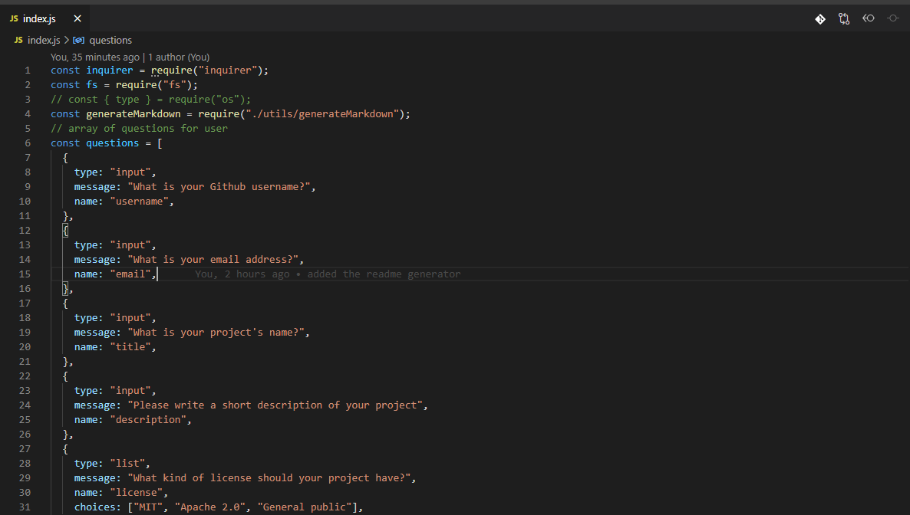
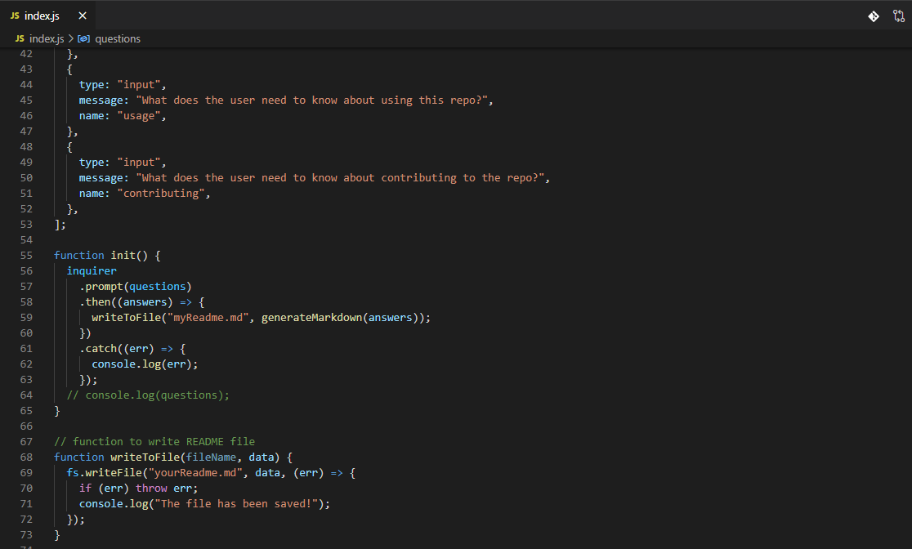
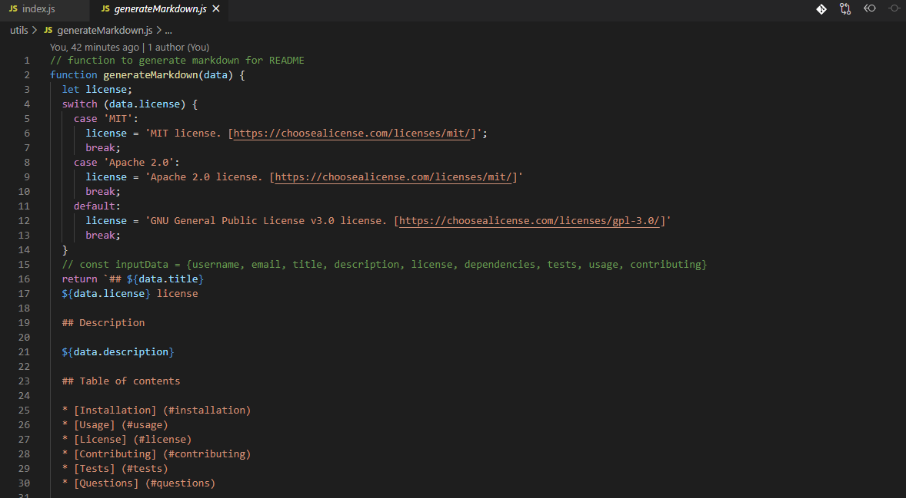
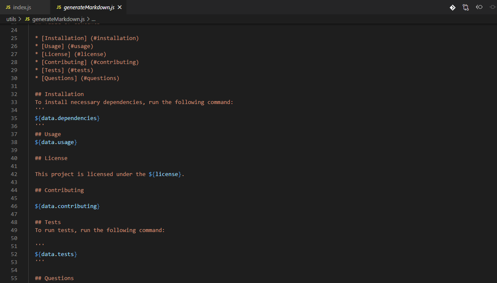
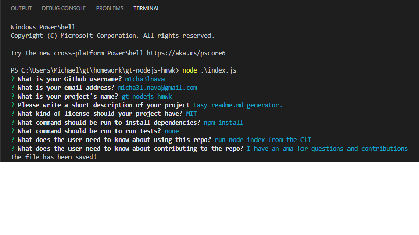
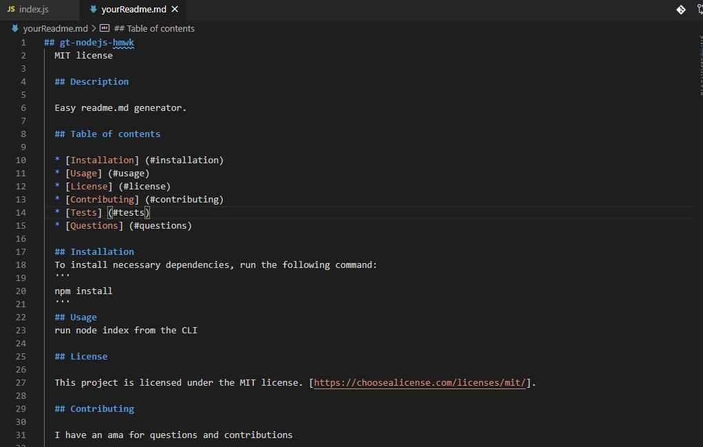
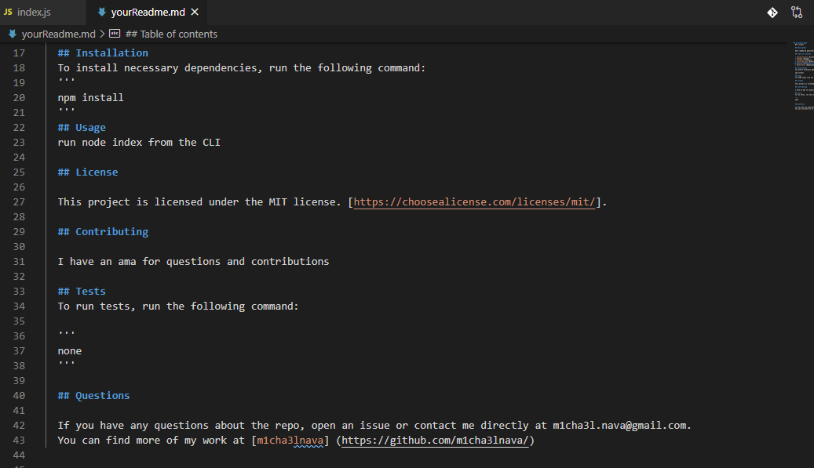

# gt-nodejs-hmwk

## Description

I created a quick and easy readme generator that takes the guess work out of creating a readme file. 
Readme files give a user important information like what packages, dependencies, or instructions the user will need.
This program prompts you with basic questions via a Command Line Interface that will be used to fill out your readme file.
As a developer we like to automate and this does just that. No more struggling to think of what to put into your readme.md file. 

## Table of Contents (Optional)

If your README is very long, add a table of contents to make it easy for users to find what they need.

- [Installation](#installation)
- [Usage](#usage)
- [Credits](#credits)
- [License](#license)

## Installation

After downloading the repo, run the command `npm install` to install the dependencies

## Usage

Use the command `node .\index.js` to run the program.

Screenshots of the code

Screenshot of the questions

Generated readme

## Credits

Georgia Tech coding bootcamp.

## License

MIT License

Copyright (c) [2020][Michael Nava]

Permission is hereby granted, free of charge, to any person obtaining a copy
of this software and associated documentation files (the "Software"), to deal
in the Software without restriction, including without limitation the rights
to use, copy, modify, merge, publish, distribute, sublicense, and/or sell
copies of the Software, and to permit persons to whom the Software is
furnished to do so, subject to the following conditions:

The above copyright notice and this permission notice shall be included in all
copies or substantial portions of the Software.

THE SOFTWARE IS PROVIDED "AS IS", WITHOUT WARRANTY OF ANY KIND, EXPRESS OR
IMPLIED, INCLUDING BUT NOT LIMITED TO THE WARRANTIES OF MERCHANTABILITY,
FITNESS FOR A PARTICULAR PURPOSE AND NONINFRINGEMENT. IN NO EVENT SHALL THE
AUTHORS OR COPYRIGHT HOLDERS BE LIABLE FOR ANY CLAIM, DAMAGES OR OTHER
LIABILITY, WHETHER IN AN ACTION OF CONTRACT, TORT OR OTHERWISE, ARISING FROM,
OUT OF OR IN CONNECTION WITH THE SOFTWARE OR THE USE OR OTHER DEALINGS IN THE
SOFTWARE.

---

## Badges

